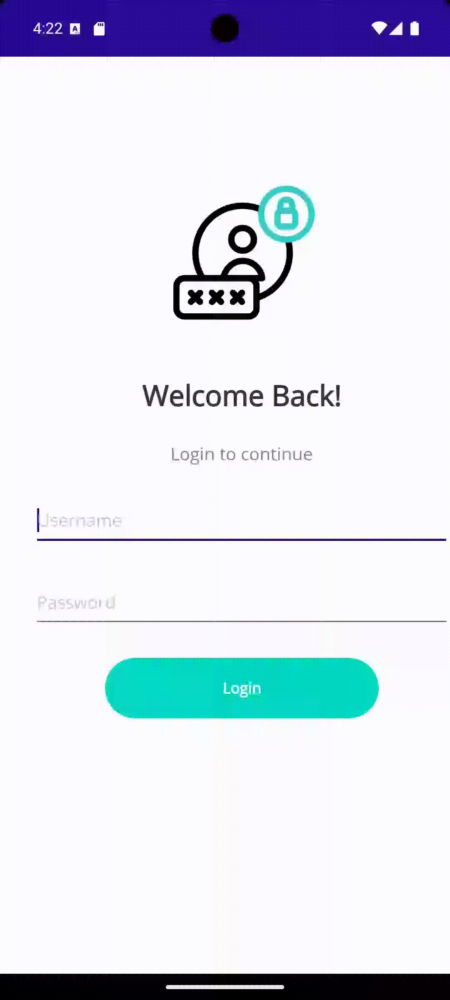

# Scanner MAUI App

A cross-platform mobile application built with .NET MAUI for scanning barcodes and managing a shopping cart.

## Features

- QR Code and Barcode scanning
- Shopping cart management
- User authentication
- Persistent storage
- Modern UI design with animations

## Technologies Used

- .NET MAUI
- ZXing.Net.MAUI for barcode scanning
- Secure storage for data persistence
- MVVM architecture

## App Showcase

| Login Screen | Scanner Interface | Cart Management |
|:------------:|:----------------:|:---------------:|
|  |  |  |

## Getting Started

1. Clone the repository
2. Open the solution in Visual Studio 2022
3. Build and run the application
4. Login with default credentials:
   - Username: admin
   - Password: 1234

## Requirements

- .NET 8.0
- Visual Studio 2022
